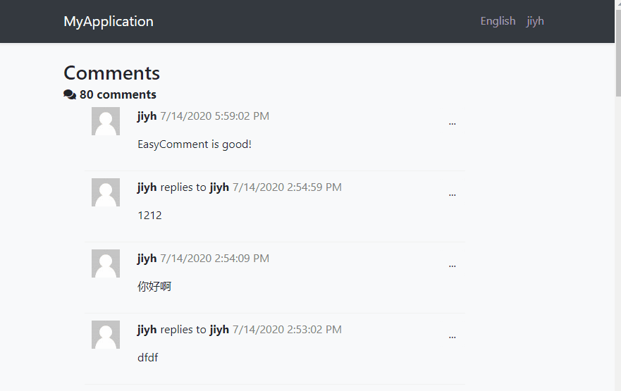
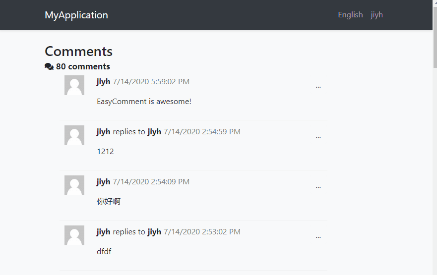

> The module is in the early development stage

# EasyComment

An ABP application module provides a flexible comment system.

# Features

* Based on [ABP Widgets System](https://docs.abp.io/en/abp/latest/UI/AspNetCore/Widgets)

    You can reuse the comment widgets in your applications, attach to arbitrary contents.

* Ajax loading
* User avatar display

   Can integrate third-party avatar services
* Comment actions: Publish, Edit, Reply, Reference, Delete
* Comment management backend
* Rich text editors support (planned)
* Flexible permission control (planned)
* More...

# Some preview GIFs

* Edit a comment

    

* Loading comments

    

